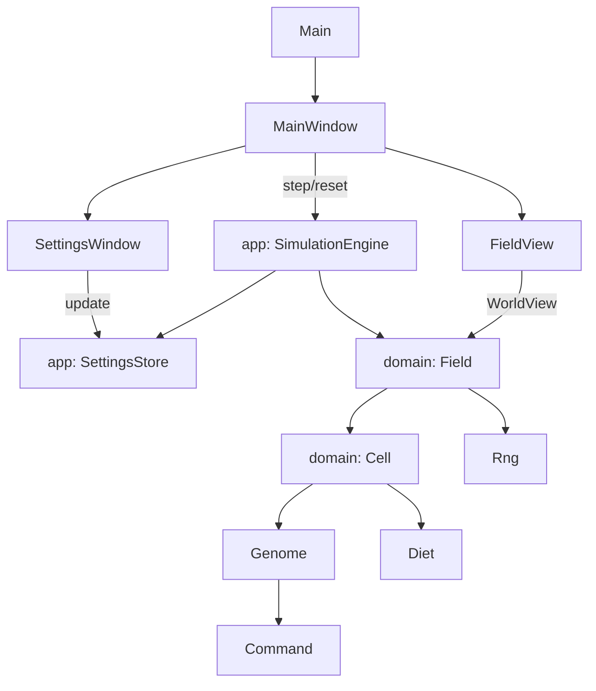
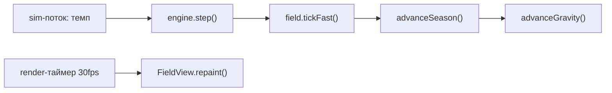
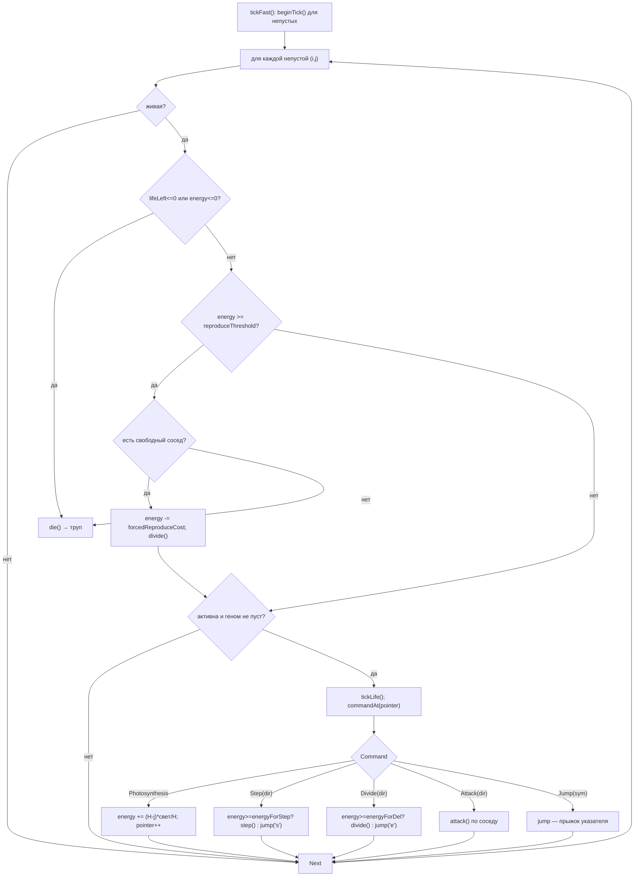
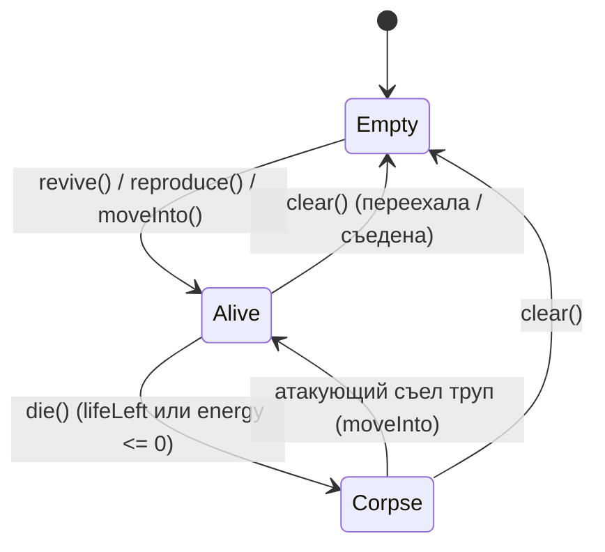

# Механизм работы Bioloji

## Что это
`Bioloji` — симуляция «чашки Петри» (artificial life) на Scala 3 + Swing. По полю
живут клетки, у каждой есть **геном** — строка из символов `12345678seafc`, которая
работает как программа крошечной виртуальной машины: цифры = направления, буквы =
команды (`s` шаг, `e` деление, `a` атака, `f` фотосинтез, `c` падальщик). Клетки питаются светом,
двигаются, размножаются с мутациями, дерутся, умирают и оставляют трупы.

## Архитектура (DDD: слои)
Код разделён на три слоя — **домен** (правила), **приложение** (оркестрация) и
**отображение** (Swing). Слой отображения зависит от домена только через
read-only трейты и не может менять состояние.

```
com.company
├── domain/   — чистые правила, без Swing и без глобального состояния
├── app/      — оркестрация: движок симуляции + хранилище настроек
└── ui/       — Swing: окна, отрисовка, окраска
```

### Домен (`com.company.domain`)
- `SimulationConfig` — **иммутабельное** значение со всеми настраиваемыми
  параметрами (энергии, сезоны, свет, хищничество, генетика, seed). Заменяет
  прежние глобальные `var`.
- `Rng` / `SeededRng` — ГСЧ как **инжектируемый инстанс** (а не глобальный
  синглтон), сидируемый для воспроизводимости и тестов.
- `Direction` — геометрия направлений 1..8 (смещения, валидность) — pure.
- `Genome` — value object и единый источник декодинга: `commandAt` (разбор
  команды), `jumpTarget` (прыжок указателя), `mutate(rng, cfg)`, `isKin`.
- `Command` / `GenAction` — ADT разобранной команды / тип действия для UI.
- `Diet` — иммутабельный «рацион» (свет/добыча/трупы) для окраски и наследования.
- `CellState` — `enum`: `Empty / Alive / Corpse`.
- `Cell` — Entity (identity `id`): состояние, энергия, геном, доменные переходы
  (`revive`, `die`, `moveInto`, `reproduce`, `attackedBy`, …).
- `Field` — **Aggregate Root** и «императивная оболочка»: сетка `W×H`, индекс
  занятости (BitSet), таймеры сезона/гравитации, шаг `tick()` / `tickFast()`.
- `CellView` / `WorldView` — read-only проекции для слоя отображения.
- `StepExplanation` — read-модель «что сделает клетка в этот ход».

### Приложение (`com.company.app`)
- `SettingsStore` — `AtomicReference[SimulationConfig]`: атомарная замена
  конфигурации (живая настройка вместо правки глобалей).
- `SimulationEngine` — владеет `Field` + `Rng`, читает конфиг из стора:
  `step()` (тик + сезон + гравитация) и `reset()` (новый ГСЧ + новое поле).

### Отображение (`com.company.ui`)
- `Main` — точка входа, открывает `MainWindow`.
- `MainWindow` — главное окно; поток симуляции дёргает `engine.step()`, отдельный
  таймер перерисовки (30 fps) независим от скорости симуляции.
- `FieldView` — Swing-компонент, **только рисует** поле, читая `WorldView`.
- `FieldColors` — чистая логика окраски (фон-освещённость, цвет рациона/энергии).
- `GenomeWindow` / `GenomeView` — окно генома в стиле Scratch + панель «Почему».
  Позволяет скопировать геном в буфер обмена и вручную заменить геном живой
  клетки (правка идёт через `SimulationEngine.setGenome` под замком тика).
- `DirectionView` — презентация направлений (стрелки, названия, компас).
- `SettingsWindow` — правит `SimulationConfig` через `SettingsStore`.



## Главный цикл
Поток симуляции (`MainWindow`) с «кредитным» ограничителем темпа вызывает
`engine.step()`; таймер отрисовки перерисовывает `FieldView`. `engine.step()`:
синхронизирует актуальный конфиг → `field.tickFast()` → `advanceSeason()` →
`advanceGravity()`.



## Шаг симуляции + интерпретатор генома
Сердце программы — `Field.processCell`. Сначала `tickFast`/`tick` сбрасывают флаги
клеток (`beginTick`). Затем для каждой живой клетки: тление трупа, проверка
смерти, принудительное деление при переизбытке энергии и выполнение **одной**
команды генома по указателю `pointer`. Команда декодируется один раз через
`Genome.commandAt` (та же логика используется и в `Field.explain` для UI — без
дублирования).



Ключевые детали:
- **Направления и соседи** — `Field.neighbor` (через `Direction.offset`): 8
  направлений с учётом границ. `y` растёт вниз, поэтому фотосинтез `(H - j)` даёт
  больше энергии клеткам наверху — «свет сверху».
- **Атака** — `Cell.attackedBy`: труп съедается всегда (+`corpseBonus` и переезд
  в его ячейку через `moveInto`). Живую жертву едят, только если она **не родня**
  (`Genome.isKin`) и атакующий сильнее на `>preyAdvantage` энергии (+`weakPreyBonus`).
  Иначе атакующий получает штраф `retribution`. Удар `a` по живой **родне** —
  «пустой» и НЕ списывает `energyForStep` (`Field.attack`), чтобы скученный
  лайнедж не разорял сам себя.
- **Падальщик** — команда `c` (`Field.scavenge`): дешёвое (`scavengeCost`)
  поедание именно трупа. В отличие от слепых `s/e/a`, падальщик **ищет** падаль —
  предпочитает свою цифру-направление, но при отсутствии трупа берёт любой
  соседний труп (детерминированный обход 1..8); если трупов рядом нет — промах
  без затрат. Это делает падальщичество отдельной жизнеспособной стратегией, а
  не побочным эффектом `a`.
- **Размножение** — `Cell.reproduce`: потомок наследует геном родителя, с шансом
  `1/mutationChance` — мутация (`Genome.mutate`: с шансом `1/insertChance`
  вставка нового гена, иначе замена символа), потомку отдаётся часть энергии.
- **Родство** — `Genome.isKin`: различие геномов меньше `kinshipThresholdPct` %.
- **Случайность** — все случайные решения идут через инжектированный `Rng`,
  поэтому при фиксированном seed прогон детерминирован (это проверяет
  `SimulationTest`), а `tickFast` совпадает с эталонным `tick` 1-в-1.

## Жизненный цикл клетки (CellState)


Отрисовка `FieldView.paintComponent` + `FieldColors` кодируют состояние цветом:
- **Фон** — питательность среды (освещённость): градиент от тёплого жёлтого
  сверху к тёмно-синей «тени» снизу; зимой тусклее (`FieldColors.light` /
  `WorldView.lightAt`).
- **Живые клетки** — оттенок показывает рацион (`Diet`), яркость — энергию
  (`FieldColors.cell`): зелёный = фотосинтез, красный = хищник, синий = падальщик;
  чем больше энергии, тем ярче. Рацион наследуется потомком в нормированном виде.
- **Трупы** — серо-коричневые; **только что умершие** (`diedThisTick`) — тёмная
  вспышка на один кадр.

Внизу — популяция, сезон, число рождений/смертей за ход и легенда цветов.

## Энергетический баланс (главные параметры `SimulationConfig`)
- Деление `e`: `energyForDel` 150; шаг/атака `s`/`a`: `energyForStep` 250;
  падальщик `c`: `scavengeCost` 50 (заметно дешевле атаки).
- Принудительное деление при `energy ≥ reproduceThreshold` (7500), цена
  `forcedReproduceCost` (6000).
- Свет: `summerLight` 100 / `winterLight` 25 — зимой энергии от фотосинтеза в 4
  раза меньше, популяция сжимается.
- Старт: `MainWindow` создаёт движок с полем `≈363×196` и 4 стартовыми клетками.

## Итог
Петля такая: **sim-поток → `engine.step()` (`Field.tickFast`: смерть →
принудительное деление → команда генома для каждой клетки; затем сезон и
гравитация) → render-таймер `FieldView.repaint`**. Эволюция возникает из мутаций
при размножении + отбора через конкуренцию за энергию, свет и каннибализм с
защитой родни. Логика (домен) полностью отделена от отображения (UI) и не
содержит глобального изменяемого состояния.
