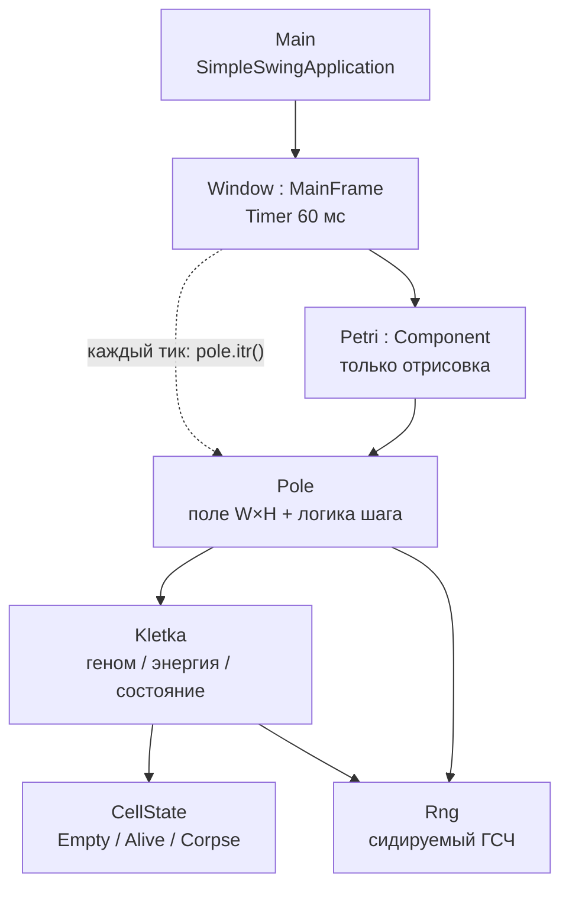
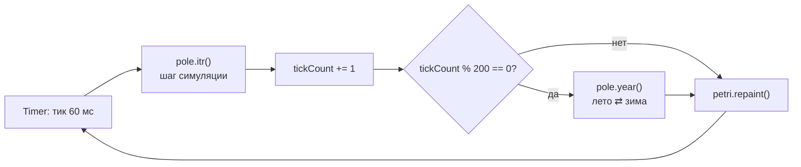
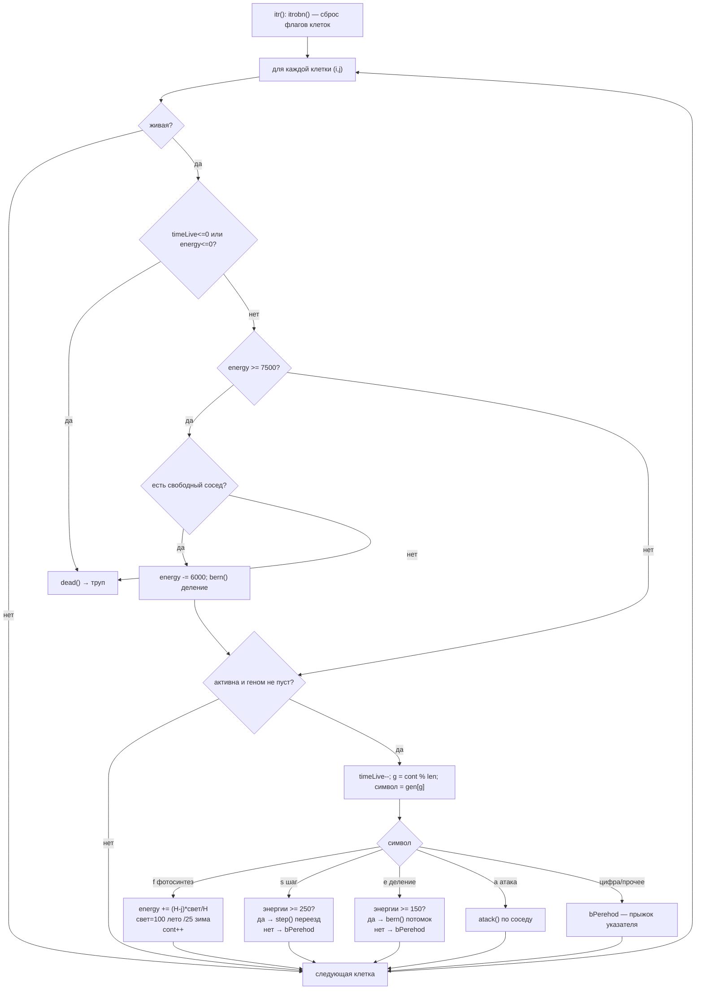
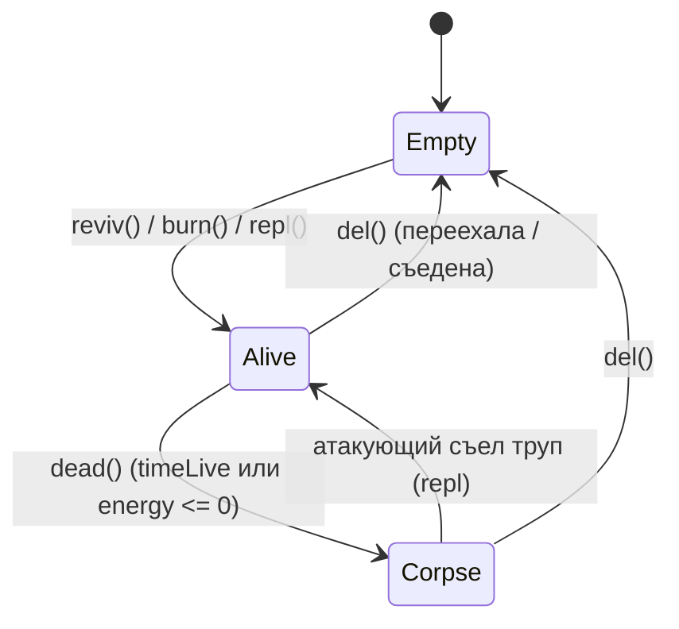

# Механизм работы Bioloji

## Что это
`Bioloji` — симуляция «чашки Петри» (artificial life) на Scala 3 + Swing. По полю живут клетки, у каждой есть **геном** — строка из символов `12345678seaf`, которая работает как программа крошечной виртуальной машины: цифры = направления, буквы = команды (`s` шаг, `e` деление, `a` атака, `f` фотосинтез). Клетки питаются светом, двигаются, размножаются с мутациями, дерутся, умирают и оставляют трупы.

## Модули
- `Main.scala:5` — точка входа, открывает `Window`.
- `Window.scala:14` — главное окно; `javax.swing.Timer` каждые 60 мс двигает симуляцию (а не цикл отрисовки — чтобы не грузить CPU).
- `Petri.scala:18` — Swing-компонент, **только рисует** поле (логики нет).
- `Pole.scala:21` — поле `W×H`, массив клеток + вся логика шага (`itr()`).
- `Kletka.scala:23` — одна клетка: состояние, геном, энергия, интерпретация команд.
- `CellState.scala:11` — `enum`: `Empty / Alive / Corpse`.
- `Rng.scala:12` — единый сидируемый генератор случайностей (для воспроизводимости/тестов).

## Главный цикл (таймер)
`Window.scala:27` — раз в 60 мс: шаг симуляции, счётчик тиков, каждые 200 тиков смена сезона (`pole.year()`), перерисовка.

## Шаг симуляции + интерпретатор генома
Сердце программы — `Pole.itr()` (`Pole.scala:46`). Сначала `itrobn()` сбрасывает флаги всех клеток. Затем для каждой живой клетки: проверка смерти, принудительное деление при переизбытке энергии, и выполнение **одной** команды генома по указателю `cont`.

Ключевые детали:
- **Направления и соседи** — `Pole.neighbor` (`Pole.scala:100`): 8 направлений с учётом границ. `y` растёт вниз, поэтому фотосинтез `(H - j)` даёт больше энергии клеткам наверху — «свет сверху».
- **Атака** — `Kletka.atack` (`Kletka.scala:129`): труп съедается всегда (+800 энергии и переезд в его ячейку через `repl`). Живую жертву едят, только если она **не родня** (`isParents`) и атакующий сильнее на >10 энергии (+400). Иначе атакующий получает штраф 20 (`Retribution`).
- **Размножение** — `Kletka.burn` (`Kletka.scala:89`): потомок наследует геном родителя, с шансом 1/6 происходит мутация (`genMut`: 1/5 — вставка нового гена, иначе — замена символа), потомку отдаётся часть энергии родителя.
- **Родство** — `isParents` (`Kletka.scala:59`): клетки считаются роднёй, если различие геномов < 20%. Защищает «своих» от поедания.
- **Случайность** — все случайные решения идут через `Rng`, поэтому при фиксированном seed прогон детерминирован (это и проверяет `SimulationTest`).

## Жизненный цикл клетки (CellState)

Отрисовка `Petri.paintComponent` (`Petri.scala:85`) кодирует состояние цветом:
- **Фон** — питательность среды (освещённость): градиент от тёплого солнечного жёлтого сверху (где `(H-j)` даёт максимум энергии фотосинтеза) к тёмно-синей «тени» снизу; зимой весь градиент в 4 раза тусклее (`lightColor` / `Pole.lightAt`).
- **Живые клетки** — оттенок показывает рацион (чем питается), яркость — запас энергии (`cellColor`): зелёный = фотосинтез, красный = хищник (ест живых), синий = падальщик (ест трупы), смешанный рацион даёт смешанный цвет; чем больше энергии, тем ярче. Источники питания накапливаются в `Kletka.fedLight/fedPrey/fedCorpse` и наследуются потомком в нормированном виде.
- **Трупы** — серо-коричневые; **только что умершие в этот ход** (флаг `justDied`) — тёмная вспышка на один кадр.

Внизу выводятся популяция, сезон, число рождений/смертей за ход и легенда цветов.

## Энергетический баланс (главные константы)
- Деление `e`: порог/стоимость 150; шаг `s`: стоимость 250 (`Pole.scala:4`).
- Принудительное деление при energy ≥ 7500, цена 6000 (`Pole.scala:7`).
- Свет: лето 100 / зима 25 (`Pole.scala:17`) — зимой энергии от фотосинтеза в 4 раза меньше, популяция сжимается.
- Старт: поле `Petri` создаёт `Pole(4, 363, 196)` — 4 случайные клетки со стартовыми геномами в верхней половине.

## Итог
Петля такая: **Timer → `Pole.itr()` (смерть → принудительное деление → команда генома для каждой клетки) → смена сезона раз в 200 тиков → `repaint`**. Эволюция возникает из мутаций при делении + отбора через конкуренцию за энергию, свет и каннибализм с защитой родни.
